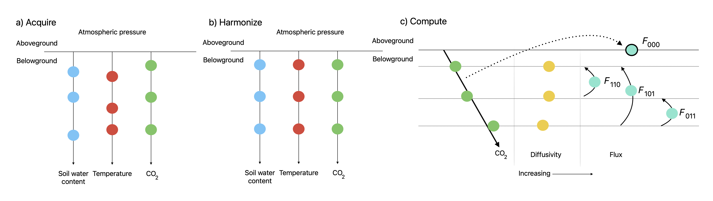

```{r, include = FALSE}
knitr::opts_chunk$set(
  collapse = TRUE,
  comment = "#>"
)
```

# Introduction
Welcome to the `neonSoilFlux` package! This vignette will guide you through the process of using this package to acquire and compute soil CO$_{2}$ fluxes at different sites in the National Ecological Observatory Network.

You can think about this package working in two primary phases:

1. acquiring the environment data for a given month at a NEON site (`acquire_neon_data`). This includes:
    a. Soil temperature at different depths.
    b. Soil water content at different depths.
    c. Soil CO$_{2}$ concentration.
    d. Atmospheric pressure
    e. Soil properties (bulk density, others)

2. Given those properties, computing the soil surface fluxes and the associated uncertainty using a variety of methods to compute fluxes (`compute_neon_flux`).

We split these two functions in order to optimize time and that both were fundamentally different processes.  Acquiring the NEON data makes use of the `neonUtilities` package. 

This package takes the guess work out of which data products to collect, hoping to reduce the workflow needed.  We rely very much on the `tidyverse` philosophy for computation and coding here. Figure \@ref(fig:diagram) dispalys a conceptual diagram of the processes in `neonSoilFlux`.

```{r diagram, echo = FALSE, fig.cap = "Model diagram for data workflow for the `neonSoilFlux` R package. a) Acquire: Data are obtained from given NEON location and horizontal sensor location, which includes soil water content, soil temperature, CO$_{2}$ concentration, and atmospheric pressure. All data are screened for quality assurance; if gap-filling of missing data occurs, it is flagged for the user. b) Any belowground data are then harmonized to the same depth as CO$_{2}$ concentrations using linear regression. c) The flux across a given depth is computed via Fick's law, denoted with $F_{ijk}$, where $i$, $j$, or $k$ are either 0 or 1 denoting the layers the flux is computed across ($i$ = closest to surface, $k$ = deepest). $F_{000}$ represents a flux estimate where the gradient $dC/dz$ is the slope of a linear regression of CO$_{2}$ with depth.", out.width = '100%'}

```

Each NEON site has three measurement layers, so we denote the flux between which two layers as a three-digit subscript $F_{ijk}$ with indicator variables $i$, $j$, and $k$ indicate if a given layer was used (written in order of increasing depth), according to the following:

-   $F_{000}$ is a surface flux estimate using the intercept of the linear regression of $D_{a}$ with depth and the slope from the linear regression of CO$_{2}$ with depth (which represents $\displaystyle \frac{dC}{dz}$ in Fick's Law). @tangAssessingSoilCO22003 used this approach to compute fluxes in an oak-grass savannah.
-   $F_{110}$, $F_{011}$ are fluxes across the two most shallow layers and two deepest layers respectively. The diffusivity used in Fick's Law is always at the deeper measurement layer. When used as a surface flux estimate we assume CO$_{2}$ remains constant above this flux depth.
-   $F_{101}$ is a surface flux estimate using linear extrapolation using concentration measurements between the shallowest and deepest measurement layer. @hiranoLongtermHalfhourlyMeasurement2003 and @tangContinuousMeasurementsSoil2005 used an approach similar to $F_{101}$ in a temperate deciduous broadleaf forest and ponderosa pine forest respectively.

Uncertainty in all $F_{ijk}$ is computed through quadrature [@taylorIntroductionErrorAnalysis2022].

## Acquiring environmental data
Load up the relevant libraries:
```{r, eval = FALSE}
library(tidyverse)
library(neonSoilFlux)
```

Let's say we want to acquire the NEON soil data at the `SJER` [site](https://www.neonscience.org/field-sites/sjer) during the month June in 2021:
```{r, eval=FALSE}
out_env_data <- acquire_neon_data(site_name = 'SJER',
                  download_date = '2022-06',
                  )
```

The output `out_env_data` for `acquire_neon_data` is a list of lists:

- The first element is `site_data`, a nested data frame containing measurements for the required flux gradient model during the given time period.
- The second element is `site_megapit`, a nested frame containing specific information about soils at the site (for bulk density calculations, etc)


Two required inputs are needed to run the function `acquire_neon_data`:

- NEON site name (a four digit code standard by NEON)
- Download date, a string in the YYYY-MM format
- Optional arguments include `time_frequency`, which is 30 minutes (`"30_minute"`; the default) or the 1 minute data (`1_minute`; currently untested) and if we download [provisional NEON data](https://www.neonscience.org/data-samples/data-management/data-revisions-releases) (`provisional = FALSE`; the default).

The `provisional` option allows acquisition of NEON data not in an [annual release cycle](https://www.neonscience.org/data-samples/data-management/data-revisions-releases).


As the data are acquired various messages from the `loadByProduct` function from the `neonUtilities` package are shown - this is normal.  Products are acquired from each spatial location (`horizontalPosition`) or vertical depth (`verticalPosition`) at a NEON site.

Outputs for `acquire_neon_data` are two nested data frames:

- `site_data` This contains three variables: the measurement name (one of `soilCO2concentration`, `VSWC` (soil water content), `soilTemp` (soil temperature), and `staPres` (atmospheric pressure)), `monthly_mean` contains the mean value of the measurement at each horizontal and vertical depth.  We compute the monthly mean using a bootstapped technique.  `data` which contains the stacked variables acquired from neonUtilities - the horizontal and vertial positions, timestamp (in UTC), associated values, the QF flag (0 = pass, 1 = fail, [LINK](https://www.neonscience.org/data-samples/data-management/data-quality-program))
- `site_megapit`: the nested data frame of the soil sampling data.  This data table is essentially what is reported back from acquiring the data product from NEON.


### Data preparation
For each data product, the `acquire_neon_data` function also performs two additional checks: 

- The soil water content data product requires some additional calibration to correct both the soil sensor depth and calibration in the function `swc_correct`.  Information about regarding this correction is found here: [LINK](https://data.neonscience.org/data-products/DP1.00094.001). Once updated sensors are installed in the future we will depreciate this function.
- The actual measurement depth (in meters) is extracted for each position.
- The monthly mean for each measurement at each depth is computed, described below.


#### Computing the monthly mean
The monthly mean is utilized when a given measurement fails final QF checks. This function is provided by [code](https://github.com/zoey-rw/microbialForecasts/blob/caa7b1a8aa8a131a5ff9340f1562cd3a3cb6667b/data_construction/covariate_prep/soil_moisture/clean_NEON_sensor_moisture_data.r) from [Zoey Werbin](https://github.com/zoey-rw).

For a given half-hour, if any input variable $\mathbf{m}$ (soil CO$_2$ concentration, soil temperature, or soil moisture) at depth $z$ is QA flagged. In this situation flagged measurements and their uncertainties were replaced with a bootstrapped monthly mean ($\overline{m}$) and monthly standard deviation ($\overline{s}$).

For each month, depth $z$, and variable, we computed bootstrapped estimates of $\overline{m}$ and $\overline{s}$ from the vectors of unflagged measurements ($\mathbf{m}$), reported standard errors ($\boldsymbol\sigma$), and the 95% confidence interval ($\boldsymbol\epsilon$, or [expanded uncertainty](https://www.neonscience.org/data-samples/data-management/data-quality-program)). We also defined a bias vector $\mathbf{b}=\sqrt{\boldsymbol\epsilon^{2}-\boldsymbol\sigma^{2}}$, which quantifies the spread of uncertainty in a given period and is incorporated into $\overline{m}$. Each of these vectors ($\mathbf{m}, \boldsymbol\sigma, \boldsymbol\epsilon, \mathbf{b}$).

From these, 5000 bootstrap samples were generated for $\mathbf{m}, \boldsymbol\sigma$, and $\mathbf{b}$. For each sample ($m_k, b_k, \sigma_k$), we generated a vector $\mathbf{n}$ (length $N=5000$) by drawing from a normal distribution with mean $m_k+b_k$ and standard deviation $\sigma_k$. The sample mean and standard deviation were then computed from $\mathbf{n}$. The resulting distributions of sample means and sample standard deviations provided the bootstrapped monthly mean ($\overline{m}$) and standard error ($\overline{s}$) respectively.

If more than 15 days of a measurement are flagged, no gap-filling is conducted.

### Visualizing outputs
With the resulting output from `acquire_neon_data`, you can then unnest the different data frames to make plots, for example:

```{r, eval=FALSE}
# Extract data
VSWC_data <- out_env_data$site_data |>
  filter(measurement == 'VSWC') |>
  unnest(cols=c("data"))

# Plot data
VSWC_data |>
  ggplot(aes(x=startDateTime,y=VSWCMean)) +
  geom_point(aes(color=as.factor(VSWCFinalQF))) +
  facet_grid(verticalPosition~horizontalPosition) +
  labs(color = "QF Flags")
```

## Diffusivity calculations
A key factor to consider is the soil diffusivity, $D_{a}$. Soil diffusivity $D_{a}$ at a given measurement depth is the product of the diffusivity in free air $D_{a,0}$ (m$^{2}$ s$^{-1}$) and the tortuosity $\xi$ (no units) [@millingtonDiffusionAggregatedPorous1971].

We compute $D_{a,0}$ with Equation \@ref(eq:da0):

\begin{equation}
  D_{a,0} = 0.0000147 \cdot \left( \frac{T_{i} + 273.15}{293.15} \right)^{1.75} \cdot \left( \frac{P}{101.3} \right)
  \label{eq:da0}
\end{equation}

where $T_{i}$ is soil temperature ($^\circ$C) at depth $i$ and $P$ surface barometric pressure (kPa).

At low soil water content, the choice of tortuosity model can lead to order-of-magnitude differences in $D_{a}$, which in turn affect modeled soil fluxes. The `neonSoilFlux` package currently includes two approaches to calculate $\xi$, representing the range of tortuosity behavior reported in @sallamMeasurementGasDiffusion1984.

The first approach is the Millington-Quirk model [@millingtonDiffusionAggregatedPorous1971], in which tortuosity depends on both porosity and soil water content:

\begin{equation}
  \xi = \frac{(\phi - SWC_{i})^{10/3}}{\phi^{2}}
  \label{eq:tortuosity-mq}
\end{equation}

In Equation \@ref(eq:tortuosity-mq), $SWC$ is the soil water content at depth $i$ and $\phi$ is the porosity (determined in the data tables `soil_megapit`):

\begin{equation}
  \phi = \left(1- \frac{\rho_{s}}{\rho_{m}} \right) \left(1-f_{V}\right)
  \label{eq:porosity}
\end{equation}

In Equation \@ref(eq:porosity), $\rho_{m}$ is the particle density of mineral soil (2.65 g cm$^{-3}$), $\rho_{s}$ the soil bulk density (g cm$^{-3}$) excluding coarse fragments greater than 2 mm and $f_{V}$ is a site-specific value that accounts for the proportion of soil fragments between 2-20 mm.  We assume that rock fragments contain no internal pores.

The Millington-Quirk model assumes $\xi$ is modulated by the amount of fluid saturation in soil pores [@millingtonDiffusionAggregatedPorous1971]. In contrast, the Marshall model [@marshallDiffusionGasesPorous1959] expresses tortuosity as only a function of porosity ($\xi = \phi^{1.5}$), with $\phi$ defined from Equation \ref{eq:porosity}. The Marshall model is independent of soil water content and assumes tortuosity is only governed by soil structure. The `neonSoilFlux` package allows users to choose the tortuosity model most appropriate for site-specific conditions and research goals.


## Computing fluxes
Once we have `out_env_data` from `acquire_neon_flux`, we then compute the fluxes at this site:
```{r, eval=FALSE}
out_fluxes <- compute_neon_flux(input_site_env = out_env_data$site_data,
                  input_site_megapit = out_env_data$site_megapit
                  )
```

The resulting data frame `out_fluxes` is a list of lists, depending on the diffusivity model used to compute fluxes:

- `marshall` is the Marshall diffusivity model.
- `millington_quirk` is the Millington-Quirk diffusivity model

Each of the lists have the following variables:

- `startDateTime`: Time period of measurement (as POSIXct)
- `horizontalPosition`: Sensor location where flux is computed
- `flux_compute`: A nested tibble with variables (1) `flux`, `flux_err`, and `method` (one of 4 implemented, denoted with `110` ($F_{110}$), `101` ($F_{101}$), `011` ($F_{011}$), `000` ($F_{000}$)), as denoted above.
- `diffusivity`: Computation of surface diffusivity
- `soilCO2concentrationMeanQF`: QF flag for soil CO2 concentration across all vertical depths at the given horizontal position: 0 = no issues, 1 = monthly mean used in measurement, 2 = QF fail
- `VSWCMeanQF`: QF flag for soil water content across all vertical depths at the given horizontal position: 0 = no issues, 1 = monthly mean used in measurement, 2 = QF fail
- `soilTempMeanQF`: QF flag for soil temperature across all vertical depths at the given horizontal position: 0 = no issues, 1 = monthly mean used in measurement, 2 = QF fail
- `staPresMeanQF`: QF flag for atmospheric pressure across all vertical depths at the given horizontal position: 0 = no issues, 1 = monthly mean used in measurement, 2 = QF fail

A QF measurement fails when there is a monthly mean could not be computed for a measurement. Note that this would cause **all** flux calculations to fail at that given horizontal position.

### Assessing Environmental QF flags
You can see the distribution the QF flags for each environmental measurement with `env_fingerprint_plot`:

```{r, eval = FALSE}
env_fingerprint_plot(out_fluxes$millington_quirk)
```

(You can also use `env_fingerprint_plot(out_fluxes$marshall)`, but the environmental data is the same, there should be no difference between the two.)

#### Explanation of QF check values:
- "Pass" means that for the given timepoint, the monthly mean was not used or the sensor was not offline.  This is the highest quality measurement.
- "Monthly Mean" means that for the given timepoint the measurement value was replaced by the monthly mean.
- "Fail" means that no measurement was available. This occurs if there is not sufficient data to compute the monthly mean.  When a measurement fails it usually will be for the entire month.

### Assessing flux QF flags
Similarly, you can see the distribution of QF flags for each diffusivity and flux computation with `flux_fingerprint_plot`:

```{r, eval = FALSE}
flux_fingerprint_plot(out_fluxes$millington_quirk)
```

#### Explanation of QF check values:
- "Pass" means that for the given timepoint, the computed flux measurement was not NA or positive (the sign of the derived flux conformed to expectations). Monthly means could be used in the computation.
- "Fail" means that the flux was not computed.  This occurs if there is not sufficient data to compute the monthly mean (one environmental measurement was "Fail"), or the computed flux was negative.


### Visualizing outputs
To plot the flux results: 

```{r, eval=FALSE}
out_fluxes$marshall |>   # Can also use millington-quirk
  select(-diffusivity) |>
  unnest(cols=c(flux_compute)) |>
  ggplot(aes(x=startDateTime,y=flux,color=method)) +
    geom_line() +
    facet_wrap(~horizontalPosition,scales = "free_y")
```

The diffusivity can be plotted similarly:

```{r, eval=FALSE}
out_fluxes$marshall |> # Can also use millington-quirk
  select(-flux_compute) |>
  unnest(cols=c(diffusivity)) |>
  ggplot(aes(x=startDateTime,y=diffusivity,color=as.factor(zOffset))) +
  geom_line() +
  facet_wrap(~horizontalPosition,scales = "free_y")  
```

